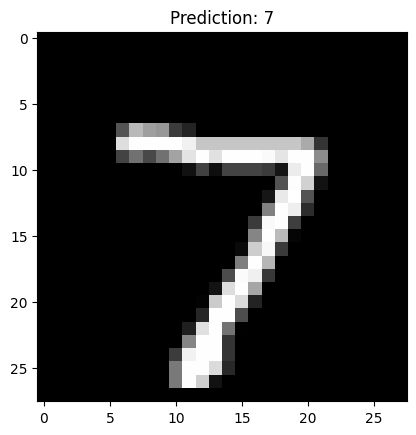

# RhombixTechnologies_Tasks

[](https://colab.research.google.com/github/sobanumer/RhombixTechnologies_Tasks/blob/main/Image_Recognition.ipynb)


This repository contains my internship tasks for **Rhombix Technologies** in the Machine Learning domain.

---

## 📌 Task 1: Image Recognition

### 🎯 Goal  
Build a simple image recognition system using deep learning.

### 📊 Dataset  
- **MNIST handwritten digits** (70,000 images, 28x28 grayscale).  
- 60,000 training images, 10,000 testing images.  

### 🛠 Method  
- Normalize and preprocess the data.  
- Train a **Convolutional Neural Network (CNN)** using TensorFlow/Keras.  
- Evaluate model on test data.  
- Make random predictions and visualize results.  

### ✅ Results  
- Achieved **98–99% accuracy** on the test set.  
- Example prediction:  



### 💻 Technologies Used  
- Python  
- TensorFlow / Keras  
- NumPy  
- Matplotlib  

---

## 🚀 How to Run
1. Clone this repo:  
   ```bash
   git clone https://github.com/sobanumer/RhombixTechnologies_Tasks.git
